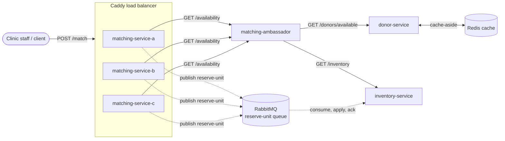

# Services

donor-service: Manages donor profiles, phenotype and blood type data, availability status, and accepts registration and availability update requests.

matching-service: Recieves the incoming patient transfusions requests and matches each patient to a compatible, available donor or inventory unit in real time. Coordinates reservations across clinics to prevent double-booking.

inventory-service: Keeps a track of 'Blood Units' by blood type and phenotype at each of our partner clinics. Accepts reservation, update, and query requests.

## System Diagram

Services built as of Sprint 4: `donor-service`, `matching-service`, and
`inventory-service` (now built — previously shown as planned only),
connected through the `matching-ambassador` (ambassador pattern sitting in
front of `matching-service`). `donor-service` caches its availability
lookups in Redis (cache-aside, keyed by blood type). `matching-service`
runs as three replicas (`matching-service-a/b/c`) behind Caddy, which
load-balances incoming requests round-robin across them; those replicas now
gate on `matching-ambassador`'s own health check rather than just its
startup.

Sprint 4 adds an asynchronous path alongside the existing synchronous
request/response flow: when a match resolves to an `inventory_unit`,
`matching-service` publishes a `reserve-unit` message to a RabbitMQ work
queue instead of reserving it synchronously, and logs the enqueue.
`inventory-service` consumes that queue independently, applies the
reservation, logs processing, and acks — the match response returns to the
client without waiting on the reservation write.

