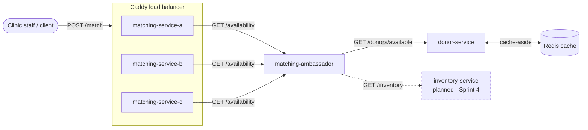

# Services

donor-service: Manages donor profiles, phenotype and blood type data, availability status, and accepts registration and availability update requests.

matching-service: Recieves the incoming patient transfusions requests and matches each patient to a compatible, available donor or inventory unit in real time. Coordinates reservations across clinics to prevent double-booking.

inventory-service: Keeps a track of 'Blood Units' by blood type and phenotype at each of our partner clinics. Accepts reservation, update, and query requests.

## System Diagram

Services built as of Sprint 3: `donor-service` and `matching-service`,
connected through the `matching-ambassador` (ambassador pattern sitting in
front of `matching-service`). `donor-service` now caches its availability
lookups in Redis (cache-aside, keyed by blood type). `matching-service` now
runs as three replicas (`matching-service-a/b/c`) behind Caddy, which
load-balances incoming requests round-robin across them. `inventory-service`
is not built yet (deferred to Sprint 4) and is shown as planned only.

