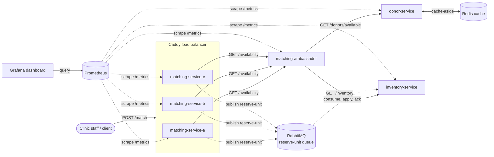

# Services

donor-service: Manages donor profiles, phenotype and blood type data, availability status, and accepts registration and availability update requests.

matching-service: Recieves the incoming patient transfusions requests and matches each patient to a compatible, available donor or inventory unit in real time. Coordinates reservations across clinics to prevent double-booking.

inventory-service: Keeps a track of 'Blood Units' by blood type and phenotype at each of our partner clinics. Accepts reservation, update, and query requests.

## System Diagram

Final system, as of Sprint 5. Four custom services: `donor-service`,
`matching-service`, `inventory-service`, and `matching-ambassador`
(ambassador pattern sitting in front of `matching-service`).
`donor-service` caches its availability lookups in Redis (cache-aside,
keyed by blood type). `matching-service` runs as three replicas
(`matching-service-a/b/c`) behind Caddy, which load-balances incoming
requests round-robin across them; those replicas gate on
`matching-ambassador`'s own health check rather than just its startup.

An asynchronous path runs alongside the synchronous request/response flow:
when a match resolves to an `inventory_unit`, `matching-service` publishes
a `reserve-unit` message to a RabbitMQ work queue instead of reserving it
synchronously, and logs the enqueue. `inventory-service` consumes that
queue independently, applies the reservation, logs processing, and acks —
the match response returns to the client without waiting on the
reservation write.

Sprint 5 adds observability: every custom service exposes `GET /metrics`
(a request counter and a response-time histogram, both in Prometheus
format) and emits structured JSON logs. Prometheus scrapes all four
services every 10s; Grafana reads from Prometheus and renders a dashboard
(auto-provisioned from a committed JSON export, no manual setup) showing
request rate, error rate, and p95 latency for the main request path.

